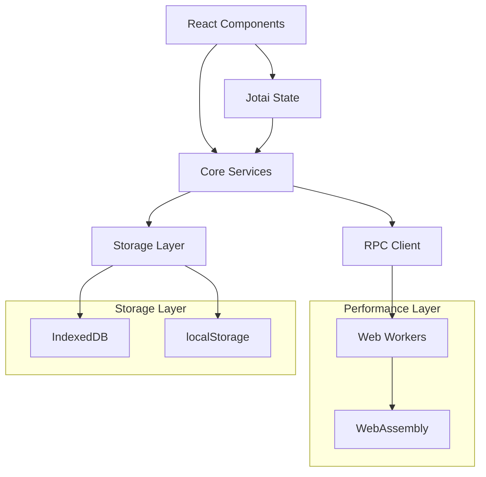
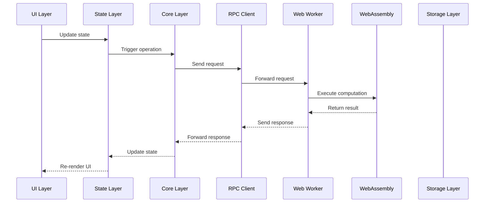
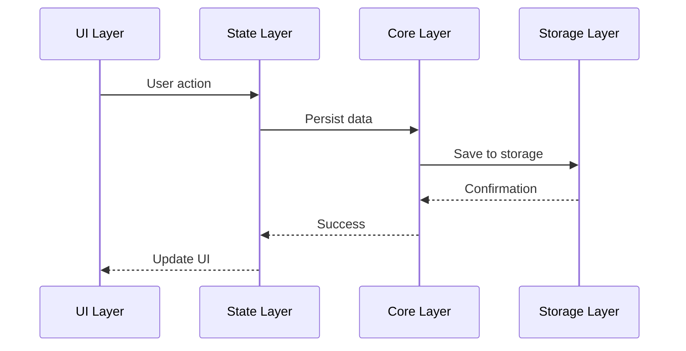
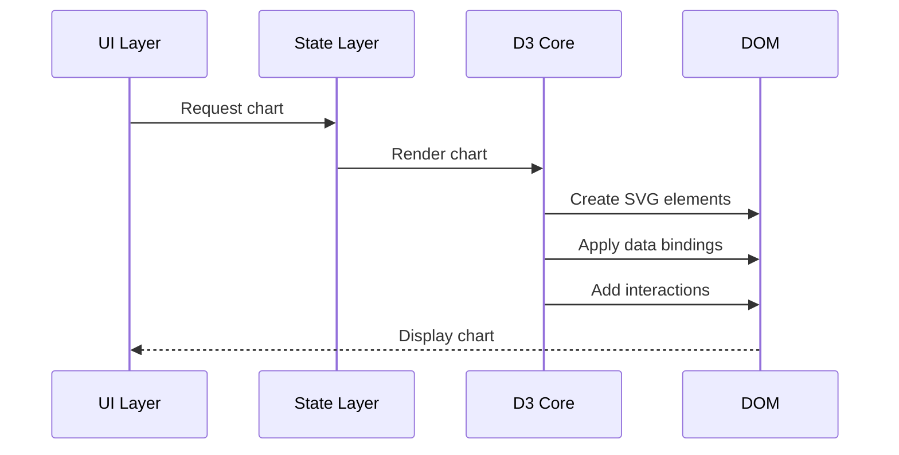

# System Architecture

This document provides a comprehensive overview of the Plug & Play Dashboard system architecture, including design principles, component relationships, and technology choices.

## 📋 Table of Contents

- [Overview](#overview)
- [Design Principles](#design-principles)
- [System Architecture](#system-architecture)
- [Component Layers](#component-layers)
- [Data Flow](#data-flow)
- [Technology Stack](#technology-stack)
- [Performance Architecture](#performance-architecture)
- [Security Architecture](#security-architecture)
- [Scalability Considerations](#scalability-considerations)

---

## 🎯 Overview

The Plug & Play Dashboard is a **modern, performant data visualization platform** designed for offline-first operation with real-time capabilities. The architecture emphasizes **modularity**, **performance**, and **maintainability**.

### Key Characteristics
- **Three-layer performance model** (Main → Workers → WASM)
- **Component-based architecture** with clear separation of concerns
- **Type-safe communication** throughout the system
- **Offline-first design** with local storage persistence
- **Progressive enhancement** for different capability levels

---

## 🏗️ Design Principles

### 1. Separation of Concerns
Each component has a single, well-defined responsibility:
- **UI Layer** - User interface and interactions
- **State Layer** - Application state management
- **Core Layer** - Essential infrastructure
- **Compute Layer** - Heavy computations and data processing
- **Engine Layer** - Web Workers and WASM execution

### 2. Performance First
Performance is a primary consideration in all architectural decisions:
- **Non-blocking operations** - Never block the UI thread
- **Lazy loading** - Load resources only when needed
- **Efficient algorithms** - Use appropriate data structures and algorithms
- **Memory management** - Prevent memory leaks and optimize usage

### 3. Type Safety
TypeScript provides compile-time and runtime safety:
- **Strict typing** - All interfaces and functions are typed
- **Type inference** - Leverage TypeScript's type inference
- **Runtime validation** - Validate data at runtime boundaries
- **Documentation types** - Types serve as documentation

### 4. Modularity
The system is designed for easy extension and maintenance:
- **Loose coupling** - Components depend on abstractions
- **High cohesion** - Related functionality is grouped together
- **Interface segregation** - Small, focused interfaces
- **Dependency inversion** - Depend on abstractions, not implementations

---

## 🏛️ System Architecture

### High-Level Architecture

```
┌─────────────────────────────────────────────────────────────┐
│                    USER INTERFACE LAYER                    │
├─────────────────────────────────────────────────────────────┤
│  React Components  │  State Management  │  User Interactions │
├─────────────────────────────────────────────────────────────┤
│                    APPLICATION CORE LAYER                    │
├─────────────────────────────────────────────────────────────┤
│  Data Engine  │  RPC Client  │  Storage  │  Utilities       │
├─────────────────────────────────────────────────────────────┤
│                    PERFORMANCE LAYER                        │
├─────────────────────────────────────────────────────────────┤
│  Web Workers  │  WASM Modules  │  Algorithms  │  Caching    │
├─────────────────────────────────────────────────────────────┤
│                    STORAGE LAYER                            │
├─────────────────────────────────────────────────────────────┤
│  IndexedDB  │  localStorage  │  Cache  │  Memory Store      │
└─────────────────────────────────────────────────────────────┘
```

### Component Relationships



---

## 📦 Component Layers

### 1. UI Layer (`src/components/`, `src/containers/`)

**Responsibility**: User interface and interactions

#### Components (`src/components/`)
- **UI Components** - Reusable UI elements (buttons, cards, etc.)
- **Chart Components** - Chart-specific UI wrappers
- **Layout Components** - Page layout and navigation

#### Containers (`src/containers/`)
- **Page Containers** - Full page implementations
- **Feature Containers** - Feature-specific components
- **Data Containers** - Data display and management

#### Key Characteristics
- **React 19** with modern hooks and patterns
- **shadcn/ui** component library
- **Tailwind CSS** for styling
- **TypeScript** for type safety

### 2. State Layer (`src/state/`)

**Responsibility**: Application state management and persistence

#### UI State (`src/state/ui/`)
- **Chart Settings** - Per-chart configuration
- **Layout State** - UI layout and transitions
- **View State** - Navigation and routing
- **RPC State** - Client connection status

#### Data State (`src/state/data/`)
- **Dataset Metadata** - Dataset information and management
- **Active Selection** - Currently selected data
- **Cache State** - Computed data and results

#### Key Characteristics
- **Jotai** for atomic state management
- **Persistence** with localStorage and IndexedDB
- **Type-safe** atoms and selectors
- **Reactive** updates throughout the application

### 3. Core Layer (`src/core/`)

**Responsibility**: Essential application infrastructure

#### Data Engine (`src/core/data-engine.ts`)
- **Unified API** for data operations
- **Storage abstraction** - Multiple storage backends
- **Type safety** for all operations
- **Error handling** and recovery

#### RPC Infrastructure (`src/core/rpc/`)
- **Client** - gRPC-style client for worker communication
- **Controllers** - Service implementations
- **Configuration** - Connection and protocol settings

#### Storage (`src/core/storage/`)
- **localStorage** - Simple key-value storage
- **IndexedDB** - Large data storage
- **Utilities** - Storage helpers and abstractions

#### Key Characteristics
- **Infrastructure** - Essential services only
- **Abstraction** - Clean interfaces for complex operations
- **Reliability** - Error handling and recovery
- **Performance** - Optimized for common operations

### 4. Compute Layer (`src/compute/`)

**Responsibility**: Heavy computations and data processing

#### Workers (`src/compute/workers/`)
- **Data Generation** - Sample data creation
- **Data Processing** - Transformation and aggregation
- **Background Tasks** - Long-running operations

#### WASM (`src/compute/wasm/`)
- **Mathematical Operations** - High-performance calculations
- **Data Algorithms** - Optimized data processing
- **Signal Processing** - FFT, filtering, etc.

#### Algorithms (`src/compute/algorithms/`)
- **Statistical Functions** - Analysis and aggregation
- **Data Transformation** - Format conversions
- **Optimization** - Performance-critical algorithms

#### Key Characteristics
- **Performance** - Optimized for speed
- **Asynchronous** - Non-blocking operations
- **Type-safe** - Full TypeScript support
- **Extensible** - Easy to add new algorithms

### 5. D3 Core Layer (`src/d3-core/`)

**Responsibility**: Data visualization engine

#### Core Utilities (`src/d3-core/core/`)
- **Scales** - Data scale generation and management
- **Axes** - Axis rendering and configuration
- **Renderer** - Series rendering (lines, areas, scatter)
- **Grid** - Grid generation and styling
- **Tooltip** - Interactive tooltips
- **Interactions** - Zoom, pan, selection

#### Charts (`src/d3-core/charts/`)
- **Base Chart** - Foundation for all charts
- **Line Chart** - Time series and line data
- **Area Chart** - Filled area visualizations
- **Scatter Plot** - Point-based data
- **Bar Chart** - Categorical comparisons

#### Key Characteristics
- **D3.js** - Powerful visualization library
- **Reusable** - Modular and composable components
- **Performant** - Optimized for large datasets
- **Interactive** - Rich user interactions

### 6. Engine Layer (`src/engine/`)

**Responsibility**: Web Worker management and execution

#### Engine Worker (`src/engine/engine.worker.ts`)
- **RPC Server** - Handles gRPC-style requests
- **Request Routing** - Routes to appropriate handlers
- **Resource Management** - Worker lifecycle management
- **Error Handling** - Graceful error recovery

#### Key Characteristics
- **Isolation** - Separate thread for processing
- **Communication** - Message-based RPC protocol
- **Resource Management** - Memory and performance optimization
- **Reliability** - Error handling and recovery

---

## 🔄 Data Flow

### Request Flow



### Data Persistence Flow



### Chart Rendering Flow



---

## 🛠️ Technology Stack

### Frontend Framework
- **React 19** - Modern UI framework with concurrent features
- **TypeScript** - Type safety and developer experience
- **Vite** - Fast development and build tool

### UI Components
- **shadcn/ui** - Modern component library
- **Tailwind CSS** - Utility-first CSS framework
- **Lucide React** - Icon library

### State Management
- **Jotai** - Atomic state management
- **Zustand** (deprecated) - Previous state solution

### Data Visualization
- **D3.js** - Powerful data visualization library
- **Custom D3 Core** - Abstracted D3 utilities

### Performance
- **Web Workers** - Background processing
- **WebAssembly** - High-performance computations
- **IndexedDB** - Client-side database

### Development Tools
- **ESLint** - Code quality
- **Prettier** - Code formatting
- **TypeScript** - Type checking

---

## ⚡ Performance Architecture

### Three-Layer Performance Model

#### Layer 1: Main Thread (UI)
- **Responsibility**: User interface and interactions
- **Optimizations**: React concurrent features, memoization
- **Constraints**: Must maintain 60fps rendering

#### Layer 2: Web Workers
- **Responsibility**: Medium-complexity computations
- **Optimizations**: Parallel processing, message batching
- **Constraints**: Limited to JavaScript performance

#### Layer 3: WebAssembly
- **Responsibility**: High-performance computations
- **Optimizations**: Native code performance, memory efficiency
- **Constraints**: Compilation overhead, interface complexity

### Performance Strategies

#### 1. Lazy Loading
```typescript
// Load components only when needed
const LazyChart = lazy(() => import('./Chart'));

// Load workers on demand
const loadWorker = () => import('./worker');
```

#### 2. Memoization
```typescript
// Memoize expensive computations
const expensiveValue = useMemo(() => {
  return computeExpensiveValue(data);
}, [data]);

// Memoize component renders
const MemoizedChart = memo(Chart);
```

#### 3. Virtualization
```typescript
// Virtualize large lists
const VirtualizedList = ({ items }) => {
  return (
    <FixedSizeList
      height={400}
      itemCount={items.length}
      itemSize={50}
    >
      {Row}
    </FixedSizeList>
  );
};
```

#### 4. Debouncing
```typescript
// Debounce user input
const debouncedSearch = useMemo(
  () => debounce(searchFunction, 300),
  [searchFunction]
);
```

### Performance Monitoring

#### Metrics Collection
- **Frame Rate** - UI rendering performance
- **Memory Usage** - Memory consumption tracking
- **Request Latency** - API response times
- **Worker Performance** - Background task performance

#### Optimization Targets
- **UI Response** < 100ms
- **Chart Rendering** < 16ms (60fps)
- **Data Processing** < 1s
- **Memory Usage** < 100MB per worker

---

## 🔒 Security Architecture

### Security Principles

#### 1. Data Validation
- **Input Validation** - All user inputs are validated
- **Type Checking** - Runtime type verification
- **Sanitization** - Data sanitization before processing

#### 2. Isolation
- **Worker Isolation** - Workers run in isolated contexts
- **WASM Sandboxing** - WASM modules are sandboxed
- **Storage Separation** - Data is isolated by origin

#### 3. Privacy
- **Local Storage** - Data stays on user device
- **No Telemetry** - No data sent to external servers
- **Encrypted Storage** - Sensitive data is encrypted

### Security Measures

#### Input Validation
```typescript
// Validate all inputs
const validateInput = (input: unknown): ValidationResult => {
  if (!isValidType(input)) {
    throw new ValidationError('Invalid input type');
  }
  return sanitizeInput(input);
};
```

#### Worker Security
```typescript
// Secure worker communication
const secureWorker = new Worker(workerUrl, {
  type: 'module',
  credentials: 'same-origin'
});
```

#### Storage Security
```typescript
// Encrypt sensitive data
const encryptData = (data: sensitive): string => {
  return crypto.subtle.encrypt(algorithm, key, data);
};
```

---

## 📈 Scalability Considerations

### Horizontal Scalability

#### Multi-Worker Architecture
- **Worker Pool** - Multiple workers for parallel processing
- **Load Balancing** - Distribute work across workers
- **Resource Management** - Optimize worker utilization

#### Data Partitioning
- **Chunking** - Process data in manageable chunks
- **Streaming** - Stream large datasets
- **Pagination** - Paginate large result sets

### Vertical Scalability

#### Performance Optimization
- **Algorithm Optimization** - Use efficient algorithms
- **Memory Management** - Optimize memory usage
- **Caching** - Cache frequently accessed data

#### Resource Management
- **Lazy Loading** - Load resources on demand
- **Resource Cleanup** - Clean up unused resources
- **Memory Monitoring** - Monitor and optimize memory usage

### Future Scalability

#### Distributed Architecture
- **Service Workers** - Background synchronization
- **Shared Workers** - Cross-tab communication
- **WebRTC** - Peer-to-peer data sharing

#### Cloud Integration
- **API Integration** - Connect to cloud services
- **Data Sync** - Synchronize with cloud storage
- **Collaboration** - Multi-user features

---

## 📋 Architecture Decisions

### Technology Choices

#### React 19
- **Rationale**: Modern features, concurrent rendering, strong ecosystem
- **Alternatives Considered**: Vue 3, Svelte, Solid.js
- **Decision**: React 19 for ecosystem and performance

#### Jotai
- **Rationale**: Atomic state, TypeScript support, performance
- **Alternatives Considered**: Zustand, Redux, MobX
- **Decision**: Jotai for simplicity and performance

#### D3.js
- **Rationale**: Powerful visualization, flexible, proven
- **Alternatives Considered**: Chart.js, Plotly.js, Victory
- **Decision**: D3.js for flexibility and power

#### WebAssembly
- **Rationale**: Performance, portability, future-proof
- **Alternatives Considered**: Pure JavaScript, WebGPU
- **Decision**: WebAssembly for maximum performance

### Architectural Patterns

#### Component Architecture
- **Pattern**: Atomic design with component composition
- **Rationale**: Reusability, maintainability, testability
- **Implementation**: shadcn/ui + custom components

#### State Management
- **Pattern**: Atomic state with persistence
- **Rationale**: Performance, type safety, simplicity
- **Implementation**: Jotai atoms with localStorage/IndexedDB

#### Performance Architecture
- **Pattern**: Three-layer performance model
- **Rationale**: UI responsiveness, scalability, maintainability
- **Implementation**: Main thread → Workers → WASM

---

## 🔄 Evolution Path

### Phase 1: Foundation (Current)
- **Core Architecture** - Established foundation
- **Basic Features** - Essential functionality
- **Performance Layer** - Worker and WASM integration

### Phase 2: Enhancement
- **Advanced Charts** - More chart types and features
- **Real-time Data** - Live data updates
- **Collaboration** - Multi-user features

### Phase 3: Scale
- **Cloud Integration** - Cloud services and sync
- **Advanced Analytics** - Complex analysis features
- **Mobile Support** - Responsive and mobile-optimized

### Phase 4: Ecosystem
- **Plugin System** - Extensible architecture
- **API Platform** - Public API for developers
- **Marketplace** - Component and plugin marketplace

---

## 📚 Related Documentation

- [Engine Protocol](ENGINE_PROTOCOL.md) — UI ↔ worker messaging (see **Implementation status** there)
- [Data Flow](DATA_FLOW.md) — ingestion and storage (see **Implementation status** there)
- [Engineering Standards](ENGINEERING_STANDARDS.md)
- [Documentation index](README.md) — which files exist vs planned

---

## 📄 License

This architecture documentation follows the same license as the main project.

---

*Architecture Version: 1.0.0 (canonical; update when layers change)*  
*Last reviewed: 2026*
