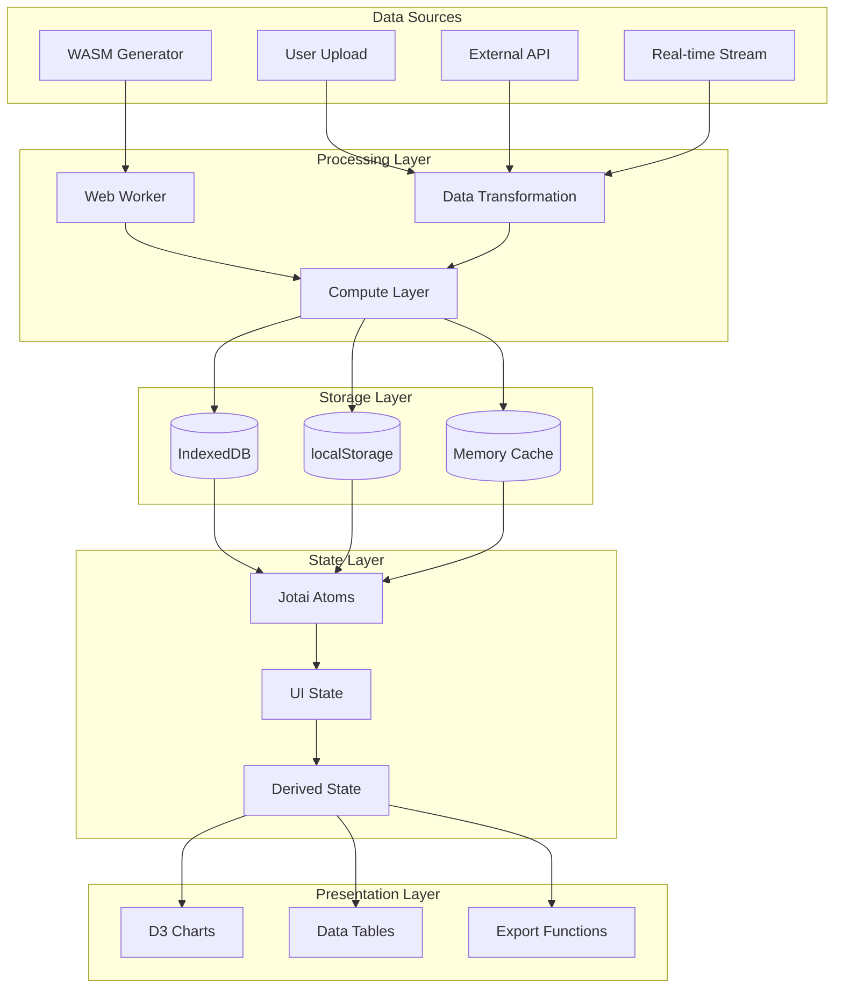
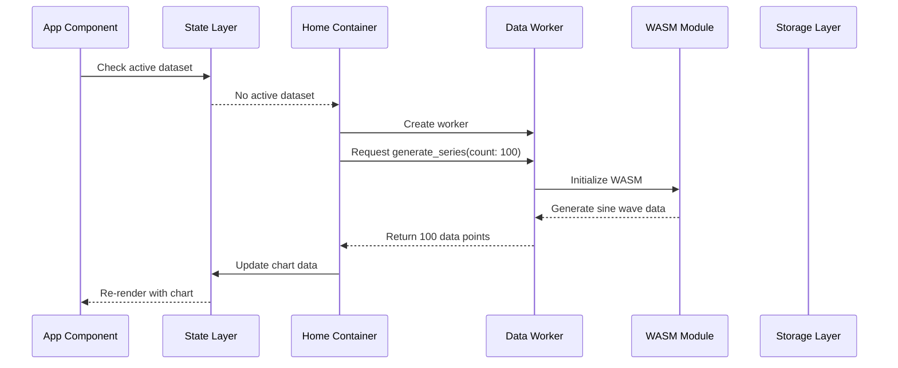
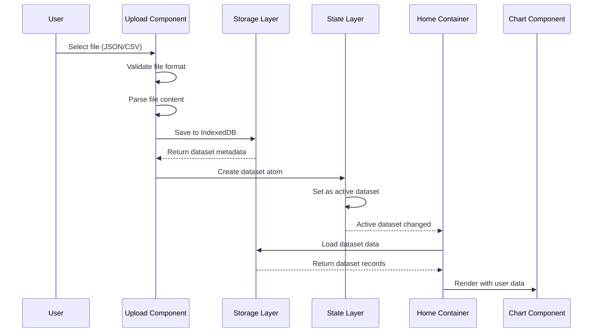
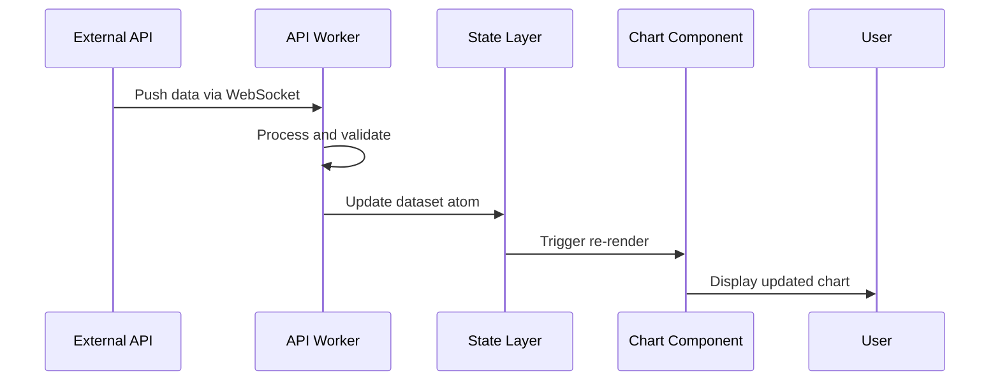
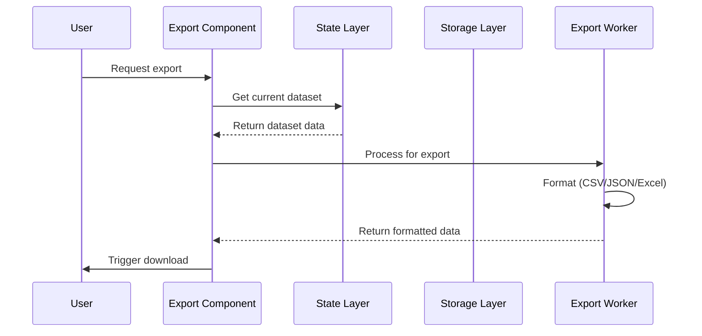

# Data Flow Documentation

This document explains how data flows through the Plug & Play Dashboard system in different scenarios, from default data generation to user-uploaded datasets.

## Implementation status (read this first)


| Area                                                        | Status                                                                                                                                                                                                                                                                                       |
| ----------------------------------------------------------- | -------------------------------------------------------------------------------------------------------------------------------------------------------------------------------------------------------------------------------------------------------------------------------------------- |
| Default sample data via worker                              | **Implemented** — `generate_series` in `[src/compute/workers/dataWorker.ts](../src/compute/workers/dataWorker.ts)`, called via `[src/compute/index.ts](../src/compute/index.ts)`                                                                                                             |
| JSON paste → IndexedDB                                      | **Implemented** — `[src/containers/datasources/components/JsonUpload.tsx](../src/containers/datasources/components/JsonUpload.tsx)` + `[src/core/data-engine.ts](../src/core/data-engine.ts)`                                                                                                |
| File upload (JSON/CSV) → IndexedDB                          | **Implemented** — same persistence path as JSON via `dataEngine`                                                                                                                                                                                                                             |
| Dataset **metadata** list (names, previews, ids for the UI) | **localStorage** key `datasources` + **IndexedDB** backup key `datasources-manifest` — see `[src/state/data/dataset-storage.ts](../src/state/data/dataset-storage.ts)`. Large previews can exceed the ~5MB localStorage quota; the full dataset always remains in IDB under `dataset:${id}`. |
| Real-time / WebSocket / export flows                        | **Not implemented** — sections below are **design targets**                                                                                                                                                                                                                                  |
| Service worker caching                                      | **Not implemented**                                                                                                                                                                                                                                                                          |


Sections marked as future behavior describe intent, not guaranteed runtime.

## 📋 Table of Contents

- [Overview](#overview)
- [Data Sources](#data-sources)
- [Scenario 1: Default Data Generation](#scenario-1-default-data-generation)
- [Scenario 2: User Uploads Dataset](#scenario-2-user-uploads-dataset)
- [Scenario 3: Real-time Data Updates](#scenario-3-real-time-data-updates)
- [Scenario 4: Data Export](#scenario-4-data-export)
- [Storage Layer](#storage-layer)
- [State Management Flow](#state-management-flow)
- [Error Handling](#error-handling)
- [Performance Considerations](#performance-considerations)

---

## 🎯 Overview

The Plug & Play Dashboard supports multiple data sources with a unified interface. Data can flow from various sources through the system while maintaining consistent state and performance.

### Data Flow Architecture




---

## 📊 Data Sources

### 1. WASM Data Generation

- **Purpose**: Default/sample data generation
- **Performance**: High performance using WebAssembly
- **Use Case**: Initial app load, demonstrations, testing
- **Data Pattern**: Sine wave, random, mathematical functions

### 2. User Uploads

- **Purpose**: User-provided datasets
- **Formats**: JSON, CSV, XML
- **Storage**: IndexedDB for large files
- **Processing**: Validation, transformation, indexing

### 3. External APIs

- **Purpose**: Real-time data from external services
- **Protocols**: REST, WebSocket, GraphQL
- **Authentication**: API keys, OAuth tokens
- **Caching**: Local cache for offline access

### 4. Real-time Streams

- **Purpose**: Live data feeds
- **Protocols**: WebSocket, Server-Sent Events
- **Update Frequency**: Sub-second to minutes
- **Buffering**: Sliding window for performance

---

## 🎲 Scenario 1: Default Data Generation

### Flow: App Startup → Default Chart Display




### Detailed Steps

#### 1. App Initialization

```typescript
// App.tsx checks for active dataset
const activeDataset = useAtomValue(activeDatasetAtom);
```

#### 2. Home Container Logic

```typescript
// Home.tsx - useEffect hook
useEffect(() => {
  if (activeDataSet) {
    // Load actual dataset (Scenario 2)
    loadDataset(activeDataSet.id);
  } else {
    // Generate default data (this scenario)
    generateDefaultData();
  }
}, [activeDataSet]);
```

#### 3. Worker Communication

```typescript
// Worker request
worker.postMessage({ 
  task: "generate_series", 
  payload: { count: 100 } 
});

// Worker response
worker.onmessage = (e) => {
  if (e.data.status === "success") {
    const data: timeseriesdata[] = e.data.data;
    setData(data); // Update state
  }
};
```

#### 4. Data Generation

```typescript
// Worker generates data
function generateSineWaveJS(count: number): timeseriesdata[] {
  const data: timeseriesdata[] = [];
  const now = Date.now();
  for (let i = 0; i < count; i++) {
    const x = new Date(now - (count - i) * 1000);
    const y = Math.sin((i / count) * 2 * Math.PI) * 100 + Math.random() * 10;
    data.push({ x, y });
  }
  return data;
}
```

#### 5. State Update

```typescript
// State updated via Jotai
const [data, setData] = useState<timeseriesdata[]>([]);
```

#### 6. Chart Rendering

```typescript
// ChartPanel receives data and renders
<ChartPanel data={data} id="chart-1" title="Default Sample Data" />
```

### Data Characteristics

- **Source**: WASM/JavaScript generation
- **Count**: 100 data points
- **Pattern**: Sine wave with noise
- **Timestamps**: Recent (last 100 seconds)
- **Storage**: In-memory only (not persisted)

---

## 📁 Scenario 2: User Uploads Dataset

### Flow: File Upload → Storage → Chart Display




### Detailed Steps

#### 1. File Selection

```typescript
// FileUpload.tsx
const handleFileUpload = async (file: File) => {
  const fileType = file.type === 'application/json' ? 'json' : 'csv';
  const content = await file.text();
  
  // Parse and validate
  const parsedData = parseFile(content, fileType);
  const dataset = await createDataset(file.name, fileType, parsedData);
  
  // Save to storage
  await dataEngine.saveDataset(dataset.id, parsedData);
};
```

#### 2. Dataset Creation

```typescript
// Dataset metadata
const dataset: DatasetMeta = {
  id: generateId(),
  name: file.name,
  type: fileType,
  size: formatFileSize(file.size),
  uploadDate: new Date().toISOString(),
  preview: parsedData.slice(0, 10),
  storageKey: datasetId
};
```

#### 3. Storage Persistence

```typescript
// IndexedDB storage
await idbSave('datasets', dataset.id, {
  metadata: dataset,
  data: parsedData
});
```

#### 4. State Management

```typescript
// Update Jotai atoms
setPersistedDatasetsAtom(prev => [...prev, dataset]);
setActiveDatasetAtom(dataset);
```

#### 5. Data Loading

```typescript
// Home.tsx loads actual dataset
const _data = await dataEngine.getDataset(activeDataSet.id);
setData(Array.isArray(_data) ? _data : [_data]);
```

### Data Characteristics

- **Source**: User file upload
- **Formats**: JSON, CSV
- **Storage**: IndexedDB (persistent)
- **Size**: Up to 50MB per dataset
- **Metadata**: Name, type, size, upload date

---

## 🔄 Scenario 3: Real-time Data Updates

### Flow: External API → Worker → State → Chart




### Implementation Details

#### 1. WebSocket Connection

```typescript
// RealtimeWorker.ts
const ws = new WebSocket('wss://api.example.com/data');

ws.onmessage = (event) => {
  const data = JSON.parse(event.data);
  
  // Update state
  updateDatasetAtom(data);
};
```

#### 2. State Updates

```typescript
// Batch updates for performance
const batchUpdate = atom(null, async (get, set, updates) => {
  const currentData = get(datasetAtom);
  const newData = [...currentData, ...updates];
  set(datasetAtom, newData);
});
```

#### 3. Chart Optimization

```typescript
// Virtual rendering for large datasets
const VirtualizedChart = ({ data }) => {
  const visibleData = useMemo(() => 
    data.slice(visibleStart, visibleEnd), 
    [data, visibleStart, visibleEnd]
  );
  
  return <LineChart data={visibleData} />;
};
```

---

## 📤 Scenario 4: Data Export

### Flow: Chart Data → Processing → Download




### Export Formats

#### 1. CSV Export

```typescript
const exportToCSV = (data: timeseriesdata[]) => {
  const headers = 'Timestamp,Value\n';
  const rows = data.map(d => `${d.x},${d.y}`).join('\n');
  return headers + rows;
};
```

#### 2. JSON Export

```typescript
const exportToJSON = (data: timeseriesdata[]) => {
  return JSON.stringify(data, null, 2);
};
```

#### 3. Excel Export

```typescript
// Using Web Worker for large datasets
worker.postMessage({
  task: 'export_excel',
  payload: { data, format: 'xlsx' }
});
```

---

## 🗄️ Storage Layer

### IndexedDB (Primary Storage)

```typescript
// Large datasets and persistence
interface IndexedDBSchema {
  datasets: {
    key: string;
    value: {
      metadata: DatasetMeta;
      data: unknown[];
    };
  };
  cache: {
    key: string;
    value: {
      data: unknown[];
      timestamp: number;
    };
  };
}
```

### localStorage (Metadata)

```typescript
// User preferences and small data
localStorage.setItem('activeDataset', JSON.stringify(dataset));
localStorage.setItem('chartSettings', JSON.stringify(settings));
```

### Memory Cache (Performance)

```typescript
// Frequently accessed data
const memoryCache = new Map<string, {
  data: unknown[];
  timestamp: number;
  ttl: number;
}>();
```

---

## 🧠 State Management Flow

### Jotai Atoms Structure

```typescript
// Data atoms
export const persistedDatasetsAtom = atomWithStorage<DatasetMeta[]>(
  "datasources",
  []
);

export const activeDatasetAtom = atomWithStorage<DatasetRef | null>(
  "activeDataset", 
  null
);

// Derived atoms
export const currentDataAtom = atom((get) => {
  const activeRef = get(activeDatasetAtom);
  if (!activeRef) return [];
  return getDatasetData(activeRef.id);
});
```

### State Updates

```typescript
// Optimistic updates
const optimisticUpdate = atom(null, async (get, set, update) => {
  // Update immediately
  set(currentDataAtom, (prev) => [...prev, update]);
  
  // Persist to storage
  await dataEngine.saveDataset(activeRef.id, updatedData);
});
```

---

## ⚠️ Error Handling

### Data Validation

```typescript
const validateDataset = (data: unknown): ValidationResult => {
  if (!Array.isArray(data)) {
    return { valid: false, error: 'Data must be an array' };
  }
  
  if (data.length === 0) {
    return { valid: false, error: 'Data cannot be empty' };
  }
  
  // Validate each record
  for (const record of data) {
    if (!record.x || !record.y) {
      return { valid: false, error: 'Missing required fields' };
    }
  }
  
  return { valid: true };
};
```

### Error Recovery

```typescript
const handleError = (error: Error, context: string) => {
  console.error(`Error in ${context}:`, error);
  
  // Show user-friendly message
  showErrorToast(`Failed to ${context}: ${error.message}`);
  
  // Fallback to default data
  if (context === 'data-loading') {
    generateDefaultData();
  }
};
```

---

## ⚡ Performance Considerations

### Data Processing

- **Workers**: Heavy processing in background threads
- **Streaming**: Process large datasets in chunks
- **Caching**: Cache computed results
- **Virtualization**: Render only visible data

### Memory Management

- **Lazy Loading**: Load data on demand
- **Cleanup**: Remove unused datasets
- **Monitoring**: Track memory usage
- **Optimization**: Use efficient data structures

### Network Optimization

- **Compression**: Compress large datasets
- **Batching**: Group multiple requests
- **Caching**: Cache API responses
- **Offline**: Store data for offline use

---

## 🔄 Data Flow Summary


| Scenario  | Data Source   | Processing           | Storage   | State      | Presentation |
| --------- | ------------- | -------------------- | --------- | ---------- | ------------ |
| Default   | WASM/JS       | Worker generation    | Memory    | Temporary  | Chart        |
| Upload    | User file     | Validation/Transform | IndexedDB | Persistent | Chart/Table  |
| Real-time | External API  | Stream processing    | Cache     | Dynamic    | Live Chart   |
| Export    | Current state | Format conversion    | Download  | N/A        | File         |


---

## 📚 Related Documentation

- [Engine Protocol](ENGINE_PROTOCOL.md) - Worker communication
- [Architecture](ARCHITECTURE.md) - System design
- [Storage Documentation](STORAGE.md) - Storage layer details
- [State Management](STATE_MANAGEMENT.md) - Jotai patterns

---

## 📄 License

This documentation follows the same license as the main project.

---

*Documentation Version: 1.0.0*  
*Last reviewed: 2026*