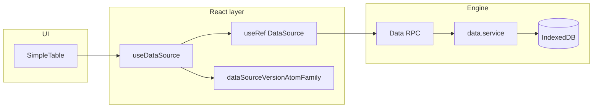
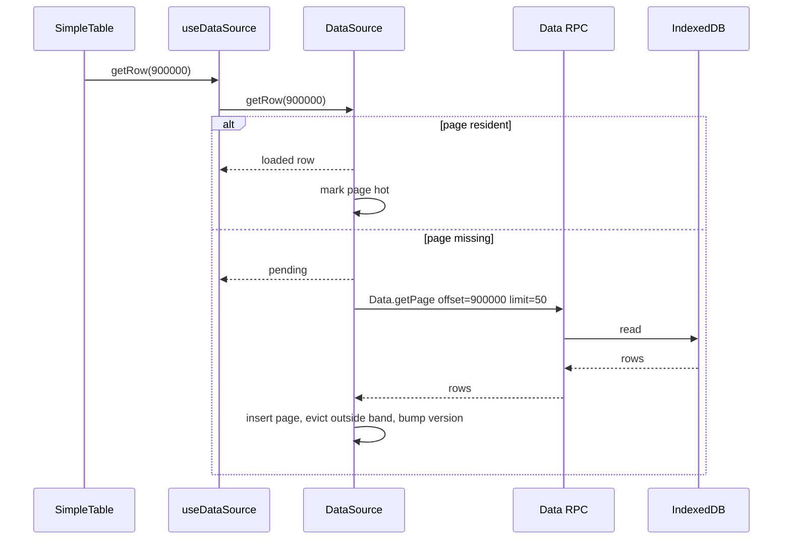

# Memory-bounded data source (tables)

**Status:** Implemented — [`useDataSource`](../../src/hooks/useDataSource.ts), [`DataSource`](../../src/core/data-source/DataSource.ts), [`SimpleTable` `dataSource` mode](../../src/components/table/SimpleTable.tsx).  
**Audience:** Engineers working on the data grid, worker `Data.*` RPC, and dashboard layout.

## 1. Context

Previously, paged tables accumulated every fetched page in React state (unbounded `setRows((prev) => [...prev, ...])`). That hook has been replaced by [`useDataSource`](../../src/hooks/useDataSource.ts) and the [`DataSource`](../../src/core/data-source/DataSource.ts) class.

Virtualization (`[SimpleTable](../../src/components/table/SimpleTable.tsx)` + TanStack Virtual) limits **DOM** work, not **in-memory row count**: scrolling through a 1M-row dataset eventually retains ~1M row objects in the main thread. Charts are a different path: `[useDatasetSlice](../../src/hooks/useDatasetSlice.ts)` replaces the window with an aggregated slice (≤ `buckets` points), so chart memory is already bounded.

This document specifies a **per-visualization, memory-bounded `DataSource`** for **table-like** consumers only.

## 2. Goals / non-goals

### Goals

- **Bound per-viz resident rows** for paged tables (O(policy), not O(dataset size)).
- Preserve `**total` row count** for the virtualizer so scroll height and “row i of N” semantics stay correct.
- **Reuse existing transport:** `Data.getPage` in `[data.service.ts](../../src/engine/services/data.service.ts)` and types in `[data-contract.ts](../../src/core/rpc/data-contract.ts)`; no new RPC methods required for v1.
- **Binding model:** each table instance gets its own `DataSource` and policy; dashboards with ~10 tiles stay well within practical memory (order of hundreds to low thousands of resident rows with chosen defaults).

### Non-goals (v1)

- **Charts** — pan/zoom pulls different shapes of data (pan = new range, zoom = re-aggregate same range); not a page-index cache problem. Keep `[useDatasetSlice](../../src/hooks/useDatasetSlice.ts)` separate; a future “chart adapter” may reuse a shared interface only if it pays for itself.
- **Cross-viz dedup** — no shared handle across multiple components in v1 (see §3 for future `Handle` seam).
- **Network-remote datasets** — spec assumes local IndexedDB + worker path; latency arguments in §4 may not apply to future remote sources.

## 3. Mental model: Binding (with a future Handle seam)

### Binding (committed for v1)

A `**DataSource`** is owned by **one visualization instance** (e.g. one table). It holds:

- A reference to `datasetId`
- A **page cache** (partial materialization of rows)
- A **retention policy** (sliding window; see §4)

Two tables on the same `datasetId` get **two caches** — possible duplicate pages in memory, but **no coupling**: one aggressive scroller cannot evict another table’s pages. For expected dashboard sizes (≈10 viz), this is acceptable.

### Future: shared `Handle`

The **public contract** (hook return type + methods used by `SimpleTable`) should be stable so a second implementation can:

- Resolve `vizId` → shared `DataSource` keyed by `(datasetId, scope)` or global pool
- Negotiate policy across consumers

Consumers should depend on `**useDataSource` / `getRow`**, not on whether the backing instance is exclusive or shared. v1 implements only the Binding backend.

### Flow (high level)




## 4. Retention policy: sliding window only

### Policy choice

**v1 uses a pure sliding window** around the **hot** region (the set of row indices the table actually needs: visible rows + virtualizer overscan). Pages **outside** the retained band are **evicted** from the in-memory cache.

**No LRU “safety cap” beyond the sliding window** in v1. Rationale (product/engineering):

- Data is **local**: `Data.getPage` reads via the worker from IndexedDB — no network RTT.
- Re-fetching an evicted page is **fast**; extra resident pages “just in case” add memory without improving UX in the common case.
- The engine (RPC, worker, slices) stays the single disciplined path to storage; the table does not second-guess it with a second layer of retention.

### What defines the band

1. From the virtualizer, compute the set of **absolute row indices** that must be renderable (visible range ± overscan).
2. Map each index `i` to **page index** `p = floor(i / pageSize)`.
3. Let `pMin = min(p)`, `pMax = max(p)` over that set.
4. Expand by `**overscanPages`** (small integer, implementation-chosen; align with table’s `nearEndThresholdPx` / virtualizer overscan — exact value deferred to implementation, see §12).
5. **Clamp** so the number of distinct resident page indices does not exceed `**bandPages`** (default **10** → at most **500 rows** at `pageSize = 50`). If expansion would exceed the cap, **drop pages farthest from the band center** (center = middle of `[pMin, pMax]` or median visible page) until under the cap.

Exact tie-breaking when trimming is an implementation detail; the invariant is: **resident page count ≤ `bandPages`** after each insert/eviction pass.

### Eviction granularity and trigger (v1 recommendation)

- **Granularity:** **page** — matches `Data.getPage` (`offset`/`limit` in row space, chunked in the worker). Evict whole pages, not arbitrary row ranges.
- **Trigger:** **synchronous on cache mutation** — when a new page is inserted or when the hot band moves, run eviction in the same turn so memory does not briefly exceed the cap. If profiling shows main-thread jank, revisit `requestIdleCallback` (§12).

## 5. Consumer API (pseudo-types)

Hook shape (names indicative; final names may match repo conventions):

```ts
type DataSourcePolicy = {
  /** Rows per page; must match worker clamp (max 500). Default 50. */
  pageSize?: number;
  /** Max full pages retained in memory. Default 10 (500 rows at default page size). */
  bandPages?: number;
  /** Pages beyond [pMin, pMax] to prefetch. Implementation default; may be derived from virtualizer. */
  overscanPages?: number;
  // Forward-compatible, non-shipping in v1:
  // memoryBudgetBytes?: number;
  // strategy?: "sliding" | "handle";
};

type GetRowResult<Row> =
  | { state: "loaded"; row: Row }
  | { state: "pending" };

type UseDataSourceArgs = {
  datasetId: string | null;
  policy?: DataSourcePolicy;
};

type UseDataSourceResult<Row> = {
  /** Absolute row index i in [0, total). */
  getRow: (i: number) => GetRowResult<Row>;
  /** Total rows in dataset (from first getPage or dedicated meta if added later). */
  total: number;
  /** Initial load / reset in flight. */
  loading: boolean;
  /** Reload from offset 0; clears cache. */
  refresh: () => void;
  /** Optional: explicit prefetch for infinite-scroll bottom (may overlap with getRow). */
  ensureBottom?: () => void;
};
```

**Usage:**

```ts
const { getRow, total, loading, refresh } = useDataSource(vizId, {
  datasetId,
  policy: { pageSize: 50, bandPages: 10 },
});
```

`vizId` is a stable id per table instance (e.g. route + panel id, or React `useId` where appropriate) for the version atom family (§7).

**Semantics of `getRow(i)`:**

- If row `i` is in a **resident** page, return `{ state: "loaded", row }`.
- Else, **schedule** a fetch for that page (if not already in flight), mark the page as **hot** for band computation, return `{ state: "pending" }`.
- When the page arrives, **evict** pages outside the band, **bump** the version atom (§7), so the table re-renders and `getRow(i)` returns `loaded`.

The **sliding window is invisible** to the caller: no manual `windowStart` / index translation.

## 6. `DataSource` class contract (no implementation here)

Responsibilities: own cache, fetch deduplication, eviction, and notify the hook to re-render when resident data changes.

### Fields (conceptual)


| Field                  | Purpose                                                     |
| ---------------------- | ----------------------------------------------------------- |
| `datasetId`            | Target dataset                                              |
| `pageSize`             | Rows per page                                               |
| `bandPages`            | Max resident pages                                          |
| `overscanPages`        | Expansion around hot range                                  |
| `total`                | Row count from worker                                       |
| `pages`                | `Map<pageIndex, Row[]>` — full pages only                   |
| `inFlight`             | `Map<pageIndex, Promise<void>>` — dedupe concurrent fetches |
| `version` / subscriber | Callback or atom writer to bump external version            |


### Methods (conceptual)


| Method                      | Behavior                                                                                      |
| --------------------------- | --------------------------------------------------------------------------------------------- |
| `getRow(i)`                 | Map `i` → page; return loaded row or pending; ensure fetch                                    |
| `ensurePage(p)`             | Idempotent fetch for page `p`                                                                 |
| `setHotRowIndices(indices)` | Optional: table passes visible indices for band (or derive only from `getRow` calls — see §9) |
| `evictOutsideBand()`        | After mutation, enforce `                                                                     |
| `reset()`                   | Clear maps, refetch page 0, reset `total`                                                     |
| `dispose()`                 | Cancel in-flight work if needed; clear references                                             |


**Invariant:** After any successful load or eviction, `pages.size ≤ bandPages` (unless initial load has not yet established `total`, in which case cap still applies once pages exist).

## 7. Ownership + re-render signal

- **Instance storage:** `useRef<DataSource>` inside `useDataSource` so the cache does not live in React state (avoid re-rendering the whole tree on every cell access).
- **Re-render signal:** `dataSourceVersionAtomFamily(vizId)` (Jotai), incremented when:
  - A page is **inserted**
  - A page is **evicted**
  - `total` or `loading` changes on reset

**Consumers:** `SimpleTable` (or its parent) **subscribes** to `dataSourceVersionAtomFamily(vizId)` so it re-renders when the materialized page set changes — not on every scroll frame, only when data arrives or leaves the cache.

Chart settings already use `atomFamily` per chart id; this mirrors that pattern for table data sources.

## 8. Defaults + config surface


| Key             | Default | Notes                                                |
| --------------- | ------- | ---------------------------------------------------- |
| `pageSize`      | `50`    | Matches current call sites; within worker max (500). |
| `bandPages`     | `10`    | ≈ **500 resident rows** per table.                   |
| `overscanPages` | TBD     | Tuned with virtualizer overscan (§12).               |


**Policy is attached to the data source** (hook args), not buried inside `SimpleTable`, so different tables or future dashboard types can pass different `bandPages` without forking the component.

Forward-compatible fields (`memoryBudgetBytes`, `strategy`) are reserved for docs only — **not** implemented in v1.

## 9. `[SimpleTable](../../src/components/table/SimpleTable.tsx)` integration

### Today

- **Dense mode:** props `data: TData[]`, optional `onScrollNearEnd`. **Paged mode:** prop `dataSource: { getRow, total, revision }` from [`useDataSource`](../../src/hooks/useDataSource.ts); no `onScrollNearEnd`.

### Target

- Parent passes `**total`**, `**getRow**`, and `**loading**` (or a small adapter object) instead of a full `rows` array.
- For each virtual row index `virtualRow.index`, call `getRow(virtualRow.index)`:
  - `**loaded`:** pass row into the column model (or build a transient row object for TanStack Table).
  - `**pending`:** render a **skeleton row** (fixed height to match row size — important for virtualizer stability).

**TanStack Table + sparse data:** The table may need **placeholder rows** or a custom row model so `getCoreRowModel` does not require a dense `data[]` of length `total`. Options (implementation picks one, document the choice in the implementation PR):

- **Thin dense window:** Only pass a `data` array sized to `total` with `null` or sentinel rows — **avoid** (defeats memory goal if misused).
- **Row model factory:** Map virtual index → row at render time; only mounted rows touch `getRow`.
- **External row ids:** Use `getRowId` / virtual rows pattern supported by TanStack v8+ so row count is `total` but cell read uses `getRow`.

Exact TanStack integration is **implementation detail**; the contract in §5 is the stable API.

**Optional:** Pass **visible index range** from the virtualizer into `DataSource.setHotRowIndices` each scroll frame for more precise band computation without relying solely on `getRow` side effects. If omitted, `getRow` calls from visible rows alone define the hot set.

## 10. Migration plan

### Call sites (current)


| File                                                                             | Usage                           |
| -------------------------------------------------------------------------------- | ------------------------------- |
| [`Dataset.tsx`](../../src/containers/dataset/Dataset.tsx) | `useDataSource` + `DataTable` `dataSource` prop |
| [`Home.tsx`](../../src/containers/home/Home.tsx) (upload path) | `useDataSource` via `HomeTableFromSource` |


### Hard-cut migration (recommended)

1. Implement `DataSource` class + `useDataSource` hook + `dataSourceVersionAtomFamily`.
2. Update `**Dataset.tsx`** and `**Home.tsx**` to use `useDataSource` with a stable `vizId` per screen/table.
3. Update `**SimpleTable**` (and types) to consume `getRow` / `total` / skeleton behavior.
4. Legacy `useDatasetPage` removed — superseded by [`useDataSource`](../../src/hooks/useDataSource.ts).
5. Run `pnpm lint` / `pnpm build`; manually smoke-test long scroll and scroll-back.

No long-lived shim unless a third call site appears before cutover.

### Order of operations

1. Class + hook + atom (no UI) + unit tests for cache/eviction.
2. `SimpleTable` API + one container migrated.
3. Second container + delete old hook.

## 11. Testing strategy (high-level)

### Unit tests (`DataSource` class)

- Insert pages P0..Pk; simulate hot range; assert **eviction** removes farthest pages and `pages.size ≤ bandPages`.
- **Re-fetch:** after eviction, `getRow` for an evicted index triggers **exactly one** RPC (or mock) per page, with **inFlight** deduplication when the same page is requested twice quickly.
- **Reset:** `reset()` clears cache and restores initial state.

### Integration / component-level

- **Large dataset:** seed IndexedDB (or mock RPC) with **1M rows**; virtual-scroll table; assert **resident page count** stays ≤ `bandPages` (or the agreed upper bound from §4) after warm-up scrolls.
- **Scroll-back:** scroll deep, scroll back to top; rows still **load** (pending → loaded), no stale wrong data at index `i`.

## 12. Open decisions (explicitly deferred)


| Topic                                             | Notes                                                                                                                  |
| ------------------------------------------------- | ---------------------------------------------------------------------------------------------------------------------- |
| **Page vs row eviction**                          | v1 recommends **page**; confirm with profiling on low-end devices.                                                     |
| **Synchronous eviction vs `requestIdleCallback`** | Start synchronous; if jank appears on eviction, defer non-critical work.                                               |
| `**overscanPages` default**                       | Derive from `[SimpleTable](../../src/components/table/SimpleTable.tsx)` virtualizer `overscan` / `nearEndThresholdPx`. |
| **Shared `Handle` implementation**                | Spec when a real requirement appears (e.g. single 100k-row working set shared across many components).                 |
| **Chart adapter**                                 | Only if a unified abstraction reduces code without forcing page semantics onto aggregation.                            |


## 13. Glossary


| Term                | Meaning                                                                                                                |
| ------------------- | ---------------------------------------------------------------------------------------------------------------------- |
| **Binding**         | One `DataSource` instance per visualization; isolated cache and policy.                                                |
| **Band**            | Contiguous range of **page indices** kept around the **hot** row indices (visible ± overscan), clamped by `bandPages`. |
| **Hot set**         | Row indices (or page indices) the UI currently needs to render; drives the sliding window.                             |
| **Page**            | Fixed-size chunk of rows (`pageSize`), aligned to `getPage` (`offset = pageIndex * pageSize`).                         |
| **Handle** (future) | Shared `DataSource` backing multiple consumers; not in v1.                                                             |


---

## Appendix: sequence diagram (`getRow` miss)




## References

- [`useDataSource.ts`](../../src/hooks/useDataSource.ts) — hook + Jotai revision atom
- [`DataSource.ts`](../../src/core/data-source/DataSource.ts) — page cache + eviction
- [`useDatasetSlice.ts`](../../src/hooks/useDatasetSlice.ts) — bounded chart path (out of scope for v1)
- [`data.service.ts`](../../src/engine/services/data.service.ts) — `getPage`, `getMeta`, etc.
- [`data-contract.ts`](../../src/core/rpc/data-contract.ts) — RPC payload types
- [`viewport.ts`](../../src/state/ui/viewport.ts) — `dataSourceVersionAtomFamily`, chart/table `atomFamily` precedents

